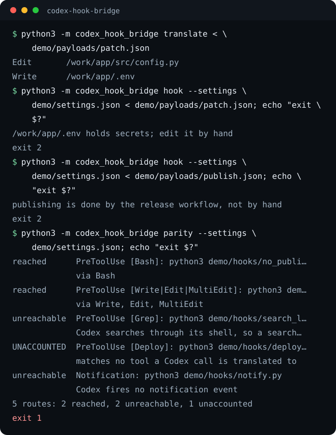

# codex-hook-bridge

Run the hooks you already wrote for Claude Code under OpenAI's Codex CLI,
without rewriting them. Installed as a Codex hook, it turns each Codex action
into the Claude Code tool calls it amounts to, runs your existing hook
commands over them, and hands their verdicts back to Codex.

[](https://github.com/eliferres/codex-hook-bridge/actions/workflows/ci.yml)




## Ten seconds to a verdict

```bash
pipx install git+https://github.com/eliferres/codex-hook-bridge
codex-hook-bridge parity
```

`parity` reads the same settings files Claude Code reads in the current
directory (`~/.claude/settings.json`, `.claude/settings.json`,
`.claude/settings.local.json`) and tells you which of those hooks a Codex
session can reach. Hooks from managed policy settings and plugins are not
read; see Limitations. It is not on PyPI; install from the repository as above.

To try it on the demo instead, clone and run it from the checkout:

```bash
git clone https://github.com/eliferres/codex-hook-bridge.git
cd codex-hook-bridge
python3 -m codex_hook_bridge hook --settings demo/settings.json < demo/payloads/publish.json
echo "exit $?"
```

That prints `publishing is done by the release workflow, not by hand` and
exit 2: the payload is a Codex shell call running `npm publish`, and
`demo/hooks/no_publish.py` is an ordinary Claude Code `PreToolUse` hook on
`Bash` that refuses it. Python 3.9+, standard library only.

### Wire it into Codex

Add the bridge to `~/.codex/hooks.json` (or a project's `.codex/hooks.json`)
once per event. Leave out `matcher` so every call reaches the bridge; your
Claude Code matchers decide what runs.

```json
{
  "hooks": {
    "PreToolUse":       [{"hooks": [{"type": "command", "command": "codex-hook-bridge hook", "timeout": 30}]}],
    "PostToolUse":      [{"hooks": [{"type": "command", "command": "codex-hook-bridge hook", "timeout": 30}]}],
    "UserPromptSubmit": [{"hooks": [{"type": "command", "command": "codex-hook-bridge hook", "timeout": 30}]}],
    "SessionStart":     [{"hooks": [{"type": "command", "command": "codex-hook-bridge hook", "timeout": 30}]}],
    "Stop":             [{"hooks": [{"type": "command", "command": "codex-hook-bridge hook", "timeout": 30}]}],
    "SubagentStart":    [{"hooks": [{"type": "command", "command": "codex-hook-bridge hook", "timeout": 30}]}],
    "SubagentStop":     [{"hooks": [{"type": "command", "command": "codex-hook-bridge hook", "timeout": 30}]}],
    "PreCompact":       [{"hooks": [{"type": "command", "command": "codex-hook-bridge hook", "timeout": 30}]}],
    "PostCompact":      [{"hooks": [{"type": "command", "command": "codex-hook-bridge hook", "timeout": 30}]}],
    "SessionEnd":       [{"hooks": [{"type": "command", "command": "codex-hook-bridge hook", "timeout": 3}]}]
  }
}
```

Codex asks you to review and trust a new hook before it runs it: open
`/hooks` in the CLI once after adding these. The bridge itself runs on macOS
and Linux.

## What a Codex call becomes

Codex reports the event name in the payload, so one command serves every
event. Tool events are translated first; each row below is one translation.

| Codex call | Claude Code payload(s) | Why |
|---|---|---|
| shell (`Bash`, `exec_command`, `shell`, `local_shell`) | `Bash` with the command, plus one `Write` per file the command writes (for each path `git restore` puts back, both a `Write` and an `Edit`, with no content) | On Codex the shell is a file-writing tool too: `sed -i`, `>`, `tee`, `cp`, `curl -o` and the rest should meet the hooks that guard paths |
| `apply_patch` | one `Write` per added file, `Edit` per hunk of an updated file, `Bash` `rm` per deleted file, `Bash` `mv` per rename; a body under a field the bridge does not read passes through as `apply_patch` | A patch touches many files at once; Claude Code's file hooks judge one file per call |
| code mode (`exec`) | each nested `tools.exec_command` and `tools.apply_patch` call whose command or patch is written in the script as a string, as above; a command held in a variable reaches `Bash` as the code that passes it, and a patch held in a variable is not read. Plus a `Write` per `fs.writeFile`, `appendFile` or `createWriteStream`, with a placeholder path when the path is not a string | The script's acts, not the script, are what a hook can judge |
| `view_image` | `Read` | Same act, same path checks |
| `web_search` | `WebSearch`, plus `WebFetch` per opened URL | Same act |
| `request_user_input` | `AskUserQuestion` | Same act |
| `spawn_agent` | `Agent` with the brief as `prompt` | Same act; Codex's own docs note `spawn_agent` also matches `Agent` |
| `send_message`, `followup_task` | `SendMessage` | Same act |
| MCP tools (`mcp__server__tool`) | unchanged | Claude Code names MCP tools the same way |
| Codex app connectors | `mcp__codex_apps__<app>__<tool>` | Hook payloads and session logs spell these two ways; one form keeps one matcher working |
| anything else | unchanged, under its Codex name | A hook matching every tool (`*`) still sees it |

Each translated payload keeps the Codex payload's other fields and adds
`codex_tool_name` (the Codex name) and, on derived payloads such as a shell
write, `codex_derived`.

## Commands, exit codes, configuration

```text
codex-hook-bridge hook      [--settings FILE]... [--project-dir DIR] [--event NAME]
                            [--budget SECONDS] [--state-dir DIR]        < payload
codex-hook-bridge translate [--json]                                    < payload
codex-hook-bridge parity    [--settings FILE]... [--project-dir DIR] [--accept FILE]
                            [--budget SECONDS] [--json]
codex-hook-bridge --version
```

`hook` is the one Codex runs. Without `--settings` it merges the user file
(in `$CLAUDE_CONFIG_DIR` when set), then the project's `.claude/settings.json`
and `.claude/settings.local.json`, taking the project from the payload's
`cwd`. All matching hooks of one call run in parallel inside `--budget`
seconds (default 25, which leaves room inside the 30-second timeout above).

`translate` prints the Claude Code payloads a Codex payload becomes, one line
each, or in full with `--json`. It runs nothing.

`parity` lists every hook route and its status: `reached` (with what reaches
it), `unreachable` (with the reason), `over-budget`, `accepted` (with your
reason) or `unaccounted`. A route is `over-budget` when its own `timeout` is
longer than the bridge's budget (`--budget`, default 25 seconds; 2.5 on
`SessionEnd`): a hook still running then is stopped, and like any timed-out
hook it does not block, so the call proceeds as if it had allowed it. A hook
with no `timeout` set is not flagged; it simply has the budget to finish in.
An accept file is a JSON list of `{"event", "matcher", "command", "reason"}`
objects for routes you know Codex cannot reach, or that you accept may be
cut short. An accepted route that Codex can in fact reach, or one that is no
longer in the settings, is reported too.

| Command | Exit | Meaning |
|---|---|---|
| `hook` | 0 | proceed; any context or warning is JSON on stdout |
| `hook` | 2 | refused; the hooks' reasons are on stderr, or the bridge's own when a command was too long to read |
| `hook` | 1 | the bridge itself could not run (a bad option, a `--settings` file that does not exist, a payload that is not JSON, an internal error); one line on stderr, and Codex proceeds |
| `parity` | 0 | every route reached, unreachable for a known reason, or accepted |
| `parity` | 1 | at least one route unaccounted or over budget, or the accept file has drifted |
| `parity`, `translate` | 2 | usage or configuration error, or (`translate`) a command too long to read; one line on stderr |

`hook` writes its own failures as exit 1, not 2, on purpose: Codex reads exit
2 as a refusal, and on `Stop` as "keep going", so a mistyped option would
otherwise block every tool call or loop the session.

A settings file that exists but is not valid settings (broken JSON, a
malformed hooks entry) is skipped on its own, as Claude Code skips it: `hook`
names the file and the problem on stderr and still runs every other file's
hooks, so one bad file never switches off the guards in the others. `parity`
reports the same file as an error and exits 2.

Hooks run with the bridge's environment plus `CLAUDE_PROJECT_DIR` (the
project folder: `--project-dir` when given, else the payload's `cwd`) and
`CODEX_HOOK_BRIDGE=1`, which a hook can test to behave differently under
Codex.

## How it works

**Verdicts are read the Claude Code way and written the Codex way.** Exit 2
blocks, using stderr. JSON `permissionDecision: "deny"`, `decision: "block"`
and `continue: false` block with their reason. `additionalContext` adds
context, and plain stdout does too on `SessionStart` and `UserPromptSubmit`.
The reply then takes the shape Codex documents for that event: exit 2 with
stderr for tool and prompt events, `{"decision": "block"}` JSON for `Stop`
and `SubagentStop` (Codex rejects plain text there; a hook's
`continue: false` passes through as itself on those two, because Codex reads
`decision: "block"` there as "keep going"), `continue: false` for
`PreCompact`, and `systemMessage` for context on events where Codex accepts
no `additionalContext`. A refusal on `SessionStart`, `SubagentStart`,
`PostCompact` or `SessionEnd` is shown as a warning, as Claude Code does,
because there is nothing to stop.

**`ask` becomes a refusal.** Codex parses `permissionDecision: "ask"` but does
not support it for hooks, so a hook that wants a human in the loop gets a
refusal that says so, rather than a silent pass.

**Every hook runs once per translated payload it matches**, a `*` or empty
matcher included, so a patch that touches three files is judged three times
by a hook that matches every tool. Only an exact duplicate goes: the same
handler defined in two settings files runs once per payload, as in Claude
Code.

**Matchers take the same shapes as in Claude Code**: empty or `*` matches
all; a matcher of only letters, digits, `_`, `-`, spaces, commas and `|` is a
list of literal names; anything else is an unanchored regular expression,
evaluated with Python's `re`, which differs from JavaScript's on some
patterns (see Limitations). Lifecycle
events match on their own field (`source` for `SessionStart`, `trigger` for
compaction, `agent_type` for subagents, `reason` for `SessionEnd`).

**Shell writes are found on a masked copy of the command.** Quoted spans,
comments and heredoc bodies are blanked first, so the `>` in
`git commit -m "a > b"` is not a redirect; a `$( ... )` inside double quotes
stays visible, because the shell runs it. Target names are then read from
the original text. Each derived `Write` carries the text the command visibly
writes (a heredoc body, the source file of a `cp`) so content checks have
something to read.

**A command too long to read in time is refused.** Reading a command takes
time in proportion to its length, about a second or two per million
characters, and that time comes out of the same budget the hooks run in. A
shell command over 1,000,000 characters, one whose `cd`s lead to a folder
path over 4,096 characters, or one that nests `bash -c` or `eval` more than
16 deep, or whose `cd`s into folders that may not exist leave more than 16
folders it could be in, is refused with exit 2 and a one-line reason
when any hook is set for that event, rather than let through unread. Split
such a command into shorter ones.

**Timeouts and crashes do not block**, matching Claude Code, where a hook
that times out or exits with anything but 0 or 2 is a non-blocking error.
Each such hook is named on stderr, including one whose command could not
start, so a broken path never passes unnoticed. Each hook runs in its own process group, so a timeout also stops whatever it
started. A guard that needs longer than the budget would let calls through
when it is slow, so `parity` flags any hook whose `timeout` is longer than
the budget.

**Transcripts are converted.** Hooks that open `transcript_path` expect
Claude Code's JSON-lines rows. The bridge keeps a converted copy of the Codex
session log under `$XDG_STATE_HOME/codex-hook-bridge/transcripts` (or
`--state-dir`), refreshed incrementally, and passes that path instead. Token
usage is mapped so input plus cache read equals Codex's own input count.
Copies not written for 30 days are deleted the next time any copy is
written. Only a copy named by one of the bridge's own marked sidecar files is
ever deleted, so other files in a shared `--state-dir` are left alone.

## Limitations

- **Claude Code events with no Codex counterpart never fire under Codex:**
  `Notification`, `PermissionDenied`, `PostToolUseFailure`, `PostToolBatch`,
  `Setup`, `InstructionsLoaded`, `UserPromptExpansion`, `MessageDisplay`,
  `StopFailure`, `TeammateIdle`, `TaskCreated`, `TaskCompleted`,
  `ConfigChange`, `CwdChanged`, `DirectoryAdded`, `FileChanged`,
  `WorktreeCreate`, `WorktreeRemove`, `PreModelSwitch`, `PostModelSwitch`,
  `Elicitation`, `ElicitationResult`. Codex does fire `PermissionRequest`,
  but the bridge does not carry approval decisions.
- **Claude Code tools with no Codex twin:** `Glob` and `Grep` (Codex searches
  through the shell, so those calls reach `Bash` hooks), `PowerShell`,
  `NotebookEdit` (notebook edits arrive as `apply_patch`), `ExitPlanMode`,
  `Skill`, `TodoWrite` and `Workflow`. A matcher naming the retired
  `MultiEdit` tool sees nothing either: each patch hunk arrives as an `Edit`.
  `parity` names each with its reason.
- **macOS and Linux only.** The bridge locks the transcript copy with `fcntl`
  and stops timed-out hooks by process group, neither of which exists on
  Windows, so it does not run there even though Codex hooks can.
- **An unreadable subagent brief is passed on as is.** When Codex hands the
  hook an encrypted or empty `spawn_agent` message, `Agent` hooks receive
  that text as `prompt`; a hook that checks briefs should treat an
  unreadable one as its own decision to make.
- **Settings files only.** Claude Code also runs hooks from managed policy
  settings, enabled plugins and skill or subagent frontmatter. The bridge
  reads none of those, so they neither run under Codex nor appear in
  `parity`, which says so on its last line.
- **Only `command` hooks run.** `http`, `mcp_tool`, `prompt` and `agent`
  handlers are skipped, and `parity` says so. The handler-level `if` field is
  not evaluated, so a hook narrowed with `if` runs on every call its matcher
  selects.
- **A hook cannot rewrite a Codex call.** `updatedInput` from a Claude Code
  hook is ignored: the payload it would rewrite is a translation, and there is
  no faithful way to map an edited `Write` back into an `apply_patch` body.
- **Shell write detection is a reading of the command text**, not a sandbox.
  It knows redirects and the common writers (`cp`, `mv`, `tee`, `sed -i`,
  `perl -i`, `dd`, `curl -o/-O/-D/-c`, `wget -O/-o/-a`, `tar -C`, `unzip -d`,
  `git checkout --`, `git restore` and more), in clustered spellings such as
  `curl -sSo` (the folder of `tar -C` and `unzip -d` is reported with and
  without a trailing slash), behind wrappers and keywords (`sudo`, `stdbuf`, `do`, `!`), and
  inside `bash -c`, `eval` and `$( ... )`; a write done by a script the
  command runs is invisible to it.
- **Relative shell writes resolve against the session folder.** Codex's
  `exec_command` hook payload carries no `workdir`, so a command run in a
  subfolder that writes `notes.txt` is reported as the session folder's
  `notes.txt`. A `cd <dir>` inside the command itself is followed, for
  patches and shell writes alike; a `cd` inside a subshell, `$( ... )` or
  backquotes holds only until that subshell closes. A `cd` into a folder that does not
  exist yet, followed by `;` or a newline rather than `&&`, may fail while
  the next command still runs, so what follows is reported under both
  folders.
- **Codex reaches only what it hooks.** Codex's documentation says hosted
  tools such as its built-in web search do not pass through hooks, so the
  `web_search` translation applies only where Codex does send the call.
  Codex also notes that some specialized tool paths can opt out of hooks.
- **Project settings come from the payload's `cwd`.** Codex runs hooks in the
  session's working directory; started from a subdirectory, it will not see
  the project root's `.claude/` unless you pass `--project-dir`.
- **The transcript format is not a stable interface** on either side. The
  converter follows the shapes Codex writes today and fails open: on any
  error, hooks get the original path.
- **Matcher regular expressions run on Python's `re`**, not JavaScript's
  `RegExp`. They agree on the patterns matchers use in practice (`|`, `.*`,
  `^`, `$`, character classes) and differ on rarer syntax.

References: the Claude Code
[hooks reference](https://code.claude.com/docs/en/hooks) for input fields,
exit codes and JSON decisions, and the Codex
[hooks documentation](https://developers.openai.com/codex/hooks) for its
events, payloads and reply shapes.

Contributions: see [CONTRIBUTING.md](CONTRIBUTING.md). MIT licensed, see [LICENSE](LICENSE).
